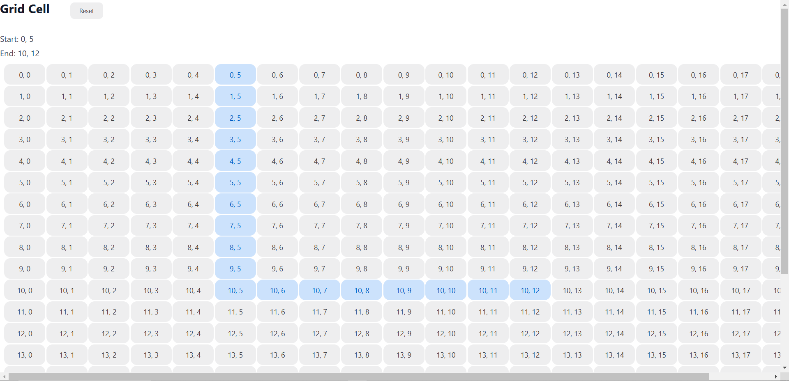

# DFS Application
An application to find shortest path between two nodes.
## UI

#### Screenshot:


#### Set up:
```bash
cd frontend
npm i
npm run dev
```

The application starts at `http://localhost:5173`

## Backend
The backend requires Java 21 to be installed in your system.

Ideally, running it in IntelliJ would be preferred.

The application doesn't require any such set up, just run the main function.

The application starts at `http://localhost:8080`

#### API
There is only one API.

It's a POST API at `http://localhost:8080/getPath`

The body should be as such (Raw/JSON): 
```JSON
{
  "start": {
    "x": 0,
    "y": 5
  },
  "end": {
    "x": 3,
    "y": 6
  }
}
```